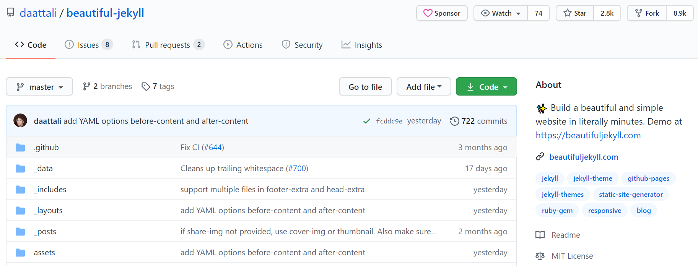

Making a website is super easy! As long as you have the right tools. The tool I used to build this site is called **Jekyll**

### Why Jekyll?

I'll be brutally honest here: Simply because **it's easy!**  
It doesn't require installing packages, configuring virtual environments,... it's pretty much ready to use!  
All you need to do is follow the yellow brick road:

### Step 1: Have a GitHub account

You need a GitHub account.


GitHub allows you to host a [static website](https://en.wikipedia.org/wiki/Static_web_page).
This means you can have your own website in GitHub.  
But it's static, so it cannot have any applications the user interacts with.
Still, that's a very small price to pay for such an easy way to make a website.

If you don't have a GitHub account, you can create one [here] (https://github.com/).  
I won't go on the details on how to set up a GitHub account here, but if you need help doing that, you can probably find it in this [tutorial](https://git-scm.com/book/en/v2/Getting-Started-Installing-Git).

### Step 2: Fork the Beautiful Jekyll repository

One you have your GitHub account set up, go the the [Beautifull Jekyll repository](https://github.com/daattali/beautiful-jekyll). You should see something like the picture below. Notice the **Fork** button, on the upper right corner. You need to click it!




When you click the Fork button, you're actually creating a copy of Beautiful Jekyll for youself. This will be the your website. Sure, you'll make changes to it. But the essential structure is already there.

This is a bit like using a template for a school project. You won't simply copy someone elses project. But it helps to have a file that's already properly formatted, so you can just change the content.

Let's begin by changing the most important thing of all:

### Step 3: Change the repository name. This will be your website address!

Once you've forked the Beautifull Jekyll repository, it should appear as a repository in your own GitHub.
You'll see a Setting button. Click on it.


This will take you to a screen where you will be able to change the name of this repository:

  

This will also be your website's URL, so take a minute to think about how you would like to name it...  
Since your name is also a URL (and since it will be hosted on GitHub), your name must have the form **whatever_you_like.github.io**. Darth Vader, for example, could name his website *Death_Star.github.io*, or *Proud_Jedi_Dad.github.io*.


### Step 4: Customizing your website

You'll notice that the Beautiful Jekyll package comes with many files. One of them is called **_config.yml**.  

This file configures your website's structure.
It has lots of stuff in it, but it's easy to understand if you just give it a try.

So open it. 
Look where it has a LinkedIn address and change it for your own.  
Do the same with the Facebook address and e-mail.  
If you don't want to show any information, just comment the entire line.  

Just open the file and go through it, changing whatever needs to be changed.      
You'll be fine, I promise!  

### You have a website!

Once you've commited the changes you made to the *_config.yml* file, you can pat yourself on the back and celebrate: You now have a website!  


"But wait!", you'll say.  
"Where are my posts? My pictures? All the content I want there to be in my website?"  

### Step 5: Your first blog post

Among all the files and folders you forked from Beautiful Jekyll, you'll find a folder names **_posts**.  

A post is simply a markdown file.  
It's a markdown file that follows 3 rules:
1. It starts with a date
2. It ends with `.md`
3. Spaces are represented by a short dasth: `-`

Want an example to make things clearer?
The file you're reading right now is called **2020-08-25-How-to-make-your-own-website.md**.

In summary:

> Write a file in markdown, name it correctly, drop it in the **\_posts** folder, and there you have it: your own blog post!  

Need a refresher in Markdown? There's awesome material out there, but why not [start with this one](https://guides.github.com/features/mastering-markdown/#intro)?  

Don't miss the section on adding pictures to a markdown document.  
Your blog will definitely need some pictures!
But you'll need to put these images into a folder.  
I put mine on the **assets** folder, inside the **img** subfolder.  

### Step 6: Own and make it your own

Beautiful Jekyll comes with a number of default files.  
The *_posts* folder has two default posts, for example.
You won't want these files in your website, so just go ahead and delete them.  

Beautiful Jekyll comes with a running default version of a website.
It's a good website, but it's not *your* website.  
It's just for illustration purposes.  
So change whatever you like.  
Keep whatever you like.  
Write your own content, and let your website come to life!

### Additional resources

If you want to learn more about [Beautiful Jekyll](https://github.com/daattali/beautiful-jekyll), a great source is their repository itself. Their `README.md`file is very helpful (in fact, that's what I followed to make this blog post). So make sure to check it out!

Don't like Beautiful Jekyll? There are many other great tools out there that you can use to make your own website. Check [pelican](https://blog.getpelican.com/) or [hugo](https://gohugo.io/) for instance. If you enhoy them and decide to write a blog post teaching how to use them, please let me know! :)


```python

```
