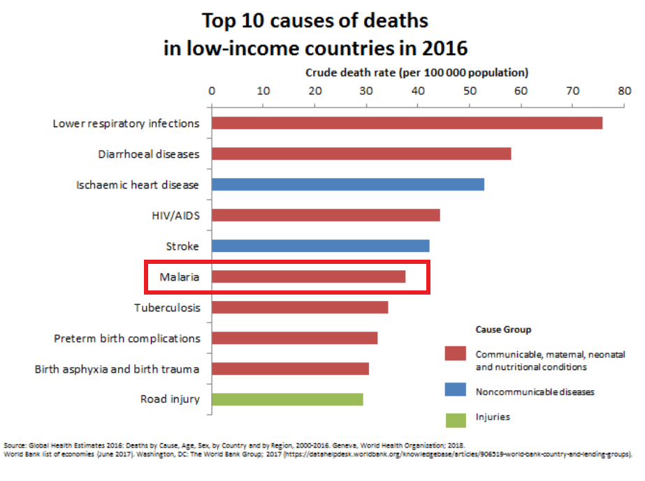
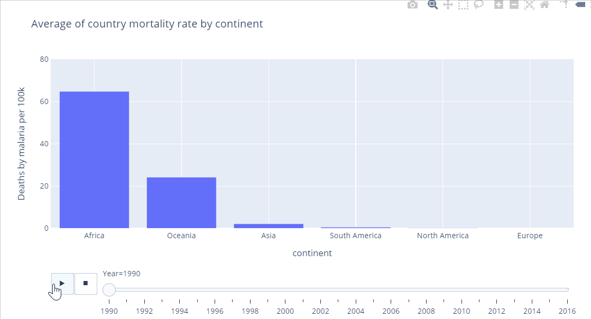

Google _Malaria_ and you'll see this:

Malaria is considered a rare disease.   
But read carefully, and you'll notice that catch: Malaria is a rare disease _in the U.S._. 

Reality is very different if you look beyond America's borders. In fact,in low income countries, malaria is among the top-10 leading causes of death:

To get a better grasp of what's going on, let's do our own analysis on malaria. We'll use data from the [MalariaAtlas project](https://malariaatlas.org/) and made available in [this GitHub repo](https://github.com/rfordatascience/tidytuesday/tree/master/data/2018/2018-11-13). 

The good news is that the world has been reducing Deaths by malaria:

However, up to 2003, malaria was rising steadily.  
Only after 2003 did the world start to defeat the desease.  
That's fairly recent, don't you think?

Look at it in another way: it took the world untill 2011 to get malaria back to the same level of mortality as it did in 1990.  
That's 21 years!

Well, better late than never!  

But let's not be to hasty...
The bad news is that a global statistic doesn't really say much. 
Global statistics may be hiding one of the major global problems: inequality.
When this happens, global aggregates may cease to be informative.
So let's check if the global statistic is representative of what happens to countries individually:

What a mess!  
It's not like all countries follow more or less what happens on the global level.  
Rather, it seems there are many countries whose mortality is far higher than the global level, and they follow quite chaotic and heterogeneous paths! 

Where are these countries?

Malaria seems clearly a much bigger problem in Africa than anywhere else in the world!  
Indeed, it seems pretty much like it's confined to Africa.
That's why our first Google searched deemed it as a rare disease in the US.

If we look at the distribution of malaria by continent, we can see that, indeed, malaria is *not* confined to Africa. 
But it does strike Africa much harder than it does any other continent.  
But there's a good news here: malaria has been significantly declining, even in Africa.  
Take a look at what happens to Africa:

We see deaths in Africa increasing and then, suddenly, changing direction and decreasing significantly.

Such decrease, however, has not been uniform in all countries. We can look at each country individually in the heatmap bellow. Note how most of the dark lines get softer over time. This means these countries have done progress in combating malaria. 

Yet, for most of those countries, malaria isn't really an issue.
So how do we identify countries where malaria really *is* an issue?

If a country has one of the 10 highest mortality rates in a year, it's fair to say it has an issue with malaria.
So let's consider all countries that have been on this list for at least a year.  
In other words, we'll look at all countries that have had one of the 10 highest mortality rates for at least one year during the 1990-2016 period.

Yet, for most of those countries, malaria isn't really an issue.
So how do we identify countries where malaria really *is* an issue?

To tackle this question, we'll look at all countries that have been among the top 20 most affected countries for at least one year, from 1990 to 2016. These countries are the following:
1. Benin
2. Burkina Faso
3. Burundi
4. Cameroon
5. Central African Republic
6. Congo
7. Cote d'Ivoire
8. Democratic Republic of Congoa cer
9. Equatorial Guinea
10. Gabon
11. Ghana
12. Guinea
13. Guinea-Bissau
14. Liberia
15. Malawi
16. Mali
17. Mozambique
18. Niger
19. Nigeria
20. Rwanda
21. Senegal
22. Sierra Leone
23. Solomon Islands
24. Tanzania
25. Togo
26. Uganda

We have over 20 countries, meaning there have been cases of countries entering and exiting the list of top 20 for a given year. Yet, given that we're spanning a subtantial number of years, such a short list suggests most countries stay on the list for a long while. But let's get back to the reason we selected these countries in the first place: they are the countries that have been hit by Malaria the harshest.

How did malaria mortality evolve in these countries?

The heatmap below suggests it really depends on the country.  
Burkina Faso didn't seem to have done much progress at all.  
Burundi, however, seems to have reduced malaria mortality substantially!

But let's be fair: even among the most harshly afflicted countries, there may still be countries that are much better or worse than others. So let's compare how they performed in improving relative to were they began, in 1990:

While most countries experience an overall decrease in mortality, not all do: Cameroon experienced a galopping 21% increase, and Equatorial Guinea is not much better. Bellow we see al countries that are actually _worse_ in 2016 than thet were in 1990.

How much does malaria affect the countries we're currently studying?  
It depends what do we mean by "affect". Affect what?  
Let's look at affecting life expectancy.  
Warning: this will be a very informal, not-at-all-statistically-rigorous analysis. But it will be fun! So let's do it!

There are many reasons why people die. Malaria does play a role... but how big is this role?  
Among the countries in our sample, some of them have had major problems besides malaria.  
Sierra Leone, for instance, was in civil war until 2002. 

We'll need data on life expectancy. We can get that from the `gapminder` dataset. Unfortunately, some years will be dropped, as we don't have life expecancy for every year.

Countries with higher malaria mortality rates are also countries with lower life expectancies.  
A steeper regression line suggests a stronger association between the two.  
It is therefore interesting to observe that the regression line becomes more horizontal over time, suggesting that malaria has become responsible for a smaller and smaller share of the factors that decrease life expectancy.

Interestingly, note the blue dot.  
That's Rwanda. 
Rwanda starts as a clear outlier in the graph: it's life expectancy is well below average.  
That's because Rwanda was the unfortunate stage of a series of violent activities that culminated in a horribly bloody [massacre](https://en.wikipedia.org/wiki/Rwandan_genocide). Watch how its life expectancy dramatically increases, and how the number of malaria casualties decreases. 

Looking at all the points, we are tempted to make two hipothesis:
1. When our series begins, malaria seems correlated to life expectancy, suggesting it is an important factor in determining how long people live in these countries;
2. When our series ends, malaria does not seem correlated to life expectancy anymore, suggesting its grown weaker and other factors have become more important in explaining life expectancy.

To make this insight a little more palpable, we let's explain life expectancy by number of deaths due to malaria. But let's control by gdp per capita and population. The amount of variance in life expectancy explained by malaria will be the change in R2 obtained by adding malaria to a regression containing only the control variables. 

More technically, for every given year, we'll fit a linear regression of life expectancy on population and gdp per capita. Call the Sum of Squared Errors of this regression $SSE_1$. Then, we add malaria mortality as an explicative variable and run a new regression. Call the Sum of Squared Errors of this new regression $SSE_2$. The fraction of variance in life expectancy explained by Malaria is given by

$$
\frac{SSE_1 - SSE_2}{SSE_1}
$$

We'll do this for every year and see how this evolves.

This is the answer we get:

Year| Fraction of life expectancy explained by Malaria |
----|-----------------------------|
1992| 3% |
1997| 18% |
2002|8% |
2007|1% |

These numbers call our attention to the heterogeneity that exists even among the most afflicted countries.
In 1997, an astonishing 18% of the variability of life expectancy among countries was explained by malaria alone.  
That's outrageous! And we're only talking about countries that were all in very bad shape as far as malaria was concerned.  
But it gets worse...

Sao Tome and Principe is not in our sample, but deserves to be mentioned. 
Through a series of public policies initiated in 2005, has managed to [reduce malaria mortality by 95%](https://www.researchgate.net/publication/23785356_Malaria_in_Sao_Tome_and_Principe_On_the_Brink_of_Elimination_after_Three_Years_of_Effective_Antimalarial_Measures) in just two years, and was aiming to [erradicate the disease altogether by 2020](http://www.shrinkingthemalariamap.org/elimination-progress/sao-tome-and-principe)... were it not for COVID-19 pandemic. 

But COVID-19 is real -- and some experts believe it [may double malaria's casualties](https://allafrica.com/stories/202008071020.html) this year in Africa. 
