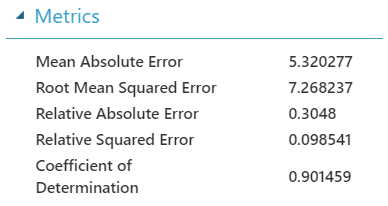
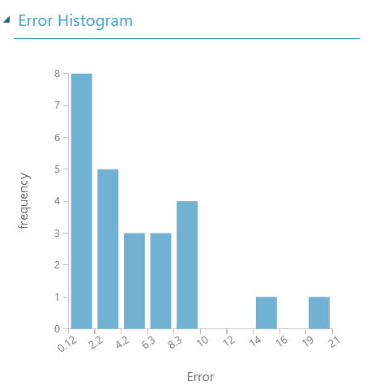
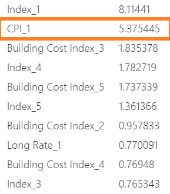

#  Predicting home prices from table salt 

Felipe Buchbinder 

## Introduction

Salt is a bitter pill to swallow for those who have never met Adam Smith:   
If unrefined salt has to be refined in order to produce refined salt, why is refined salt *cheaper* than unrefined salt?  
Shouldn't it be more *expensive*, since it needs more processing and therefore additional cost?    

While this makes sense, it turns out not to be the case.    
A product's price is the result of a tug-of-war between supply and demand. 
Sure, production costs do play a role on the supply side, but this role does not on its own determine a product's price.  

Another example where this happens is on the price of housing. One could expect that as the cost of building goes up, so should the price of houses. And yet, if you look at the relationship between them, this is what you get:


You can sort of see a linear relationship in there. But it's noisy. So yes, home prices are higher when the cost of building is higher, so cost does seem to play a role in determining home prices. But if you use the building cost to predict home prices, you'll get a very noisy -- and therefore rough -- prediction.  

Let's get back to our sea salt example. Can sea salt do better in predicting home prices? What about table cloths or face masks? -- I know, I'm deliberately framing this question in a way that looks stupid. But it turns out, that if we use the prices of consumer goods to predict home prices, we actually get something pretty neat:


Yes, this relationship is not-linear, and it's equation is much more complicated than the straight-line relationhsip we would attempt to fit between building cost and home prices. Non-linearity, however, is not a major problem. We have methods to deal with that. What matters is that the relationship between Consumer Price Index and Home Prices is **much less noisy** than the relationship between building costs and home prices. And this makes for a good predictor.

## Data source

Data was obtained from **U.S. Home Price and Related data, for Figure 3.1 in Robert J. Shiller, Irrational Exuberance, 3rd. Edition, Princeton University Press, 2015**, and is available [here](http://www.econ.yale.edu/~shiller/data/Fig3-1.xls).

## Exploratory data analysis and data transformaiton

### Variables
Our data comprises the following variables, ranging from 1890 to 2018:

* Home Prices (Shiller's Index)
* Building Cost Index
* Consumer Price Index
* US Population (Millions)
* Long-term interest rate


### Data transformations

All variables are given yearly, except for home prices, which is given yearly up to 1953, and then monthly. To match the availability of the remaining variables, we aggregated Home Prices after 1953 from monthly to yearly data, by calculating the mean value of the index for each year.

As is common practice, we take the logarithm of US Population.
Consumer Price Index also grows exponentially, so we also log-transform it. 
The evolutions of US Population and Consumer Price before and after being log-transformed is shown below.


The reason for log-transforming these variables it _not_ that their non-linearity is problematic -- Neural Networks eat non-linear functions for breakfast! The reason is when we normalize these values into the \[0,1\] range, a variable that grows exponentially will have most of its values compressed very close to zero, which may be problematic. This may be especially problematic when using the model to predict data in the future, when new data "won't fit" into the \[0,1\] range (but will be forced to!) thereby causing errors. To mitigate that, we log-transform both values. (We have attempted to run our model without such transformation, and found that results really don't change that much).

### Dependent variable

At any given year, we wish to predict the home price index of the **next** year.


### Lagging

Markets are continuous. They don't reset once the year is over. Rather, each year influences the next. We, among the features of any given year, we include features from the previous years as well. We must now discuss which variables we decided to include from previous years, and how many years back did we go to retrieve information. Let's begin by discussing the second issue. As an example, let's use our dependent variable itself, the Home Price Index.

#### Choice of how much to lag variables

It seems reasonable that if home prices are high in one year, they'll also be high in the next year, and vice-versa. As we look two years ahead, it seems reasonable that this relationship should weaken. And indeed it does. Here's the relationship between Home Prices among 1, 2 or 3 consecutive years. Notice how noise builds up and the relationship becomes weaker and weaker:


If we look at the partial autocorrelation plot, however, we see that given the home prices index of two consecutive years, we can predict the index for the following year with the same accuracy as if we had data from the last 3, 4 or 5 years. Only two years back are significant. 


Similar results hold for Consumer Price Index and long-term interest rate. But here we're only talking about correlation, so linearity is assumed. To be safe, we'll add 5 years and let the model decide for itself. But we'll not add 5 years for all variables. Only for those we chose to lag. This leads us to discuss another very important issue:

### Choice of which variables to lag

Here's a cute side effect of this project: I came up with a new method to decide how to chose which variables to lag.

This is it:


**We are looking for squares that look like kaleidoscops, or mosaics of different shades of blue**. 

So, for example, look at the square formed by the lags of Index, on the lower right corner. These are simply the Home Price Index. We see a very clear mosaic there. This means the correlation between these variables are high, but not too high, so as to be virtually the same thing. It therefore makes sense to put these variables into our model.  

The same holds true for the lags of Building Cost,  where we also see a square mosaic, as for the lags of long term rate. In both cases, the kaleidoscopic square we see tells us that these variables are not excessively correlated to be totally redundant. 

Now look at the lags of Population. We see a big, dark, homogeneous square. No mosaic. No kaleidoscope. Just a uniform patch of dark blue. This means all lags of population are very strongly correlated with one another, so we don't really need the lags at all. Knowing the population at any single year is enough.

Hence, we'll consider lags for **index** (home price index), **building cost index**, and **long term rate**, but we will *not* consider lags for consumer price index or population.

Now let's get a bit more technical and explain why this works. What exactly are we seeing here?  

Each color is the Spearman correlation -- raised to the 6th power -- between the variables of the corresponding row and column. In general, each row is given by

$$
|r_S(X,Y)|^k \\
k \geq 1
$$

We use Spearman correlation because we don't want to restrict ourselves to linear relationships between these variables. Any relationship would do -- we're going to use a Neural Network, after all! Spearman correlation captures monotonic relationships. They need not be necessarily linear, but they have to be monotonic. So its not perfect. But it's better than Pearson correlation for our needs, and it happens to be available in Pandas, so... :)

We don't really care about the sign of the correlation. We just want to know wheather an association exists, regardless of it being positive or negative. So we'll work with absolute values.

Finally comes the question of contrast. We are more concerned with distinguishing values close to 1 than we are to distinguishing values close to 0. When looking at different lags of given variable, it is *expected* that correlations will be high, so squares are naturally bound to form around the diagonal. We are very concerned with these squares, and not very much concerned with what happens outside these squares. So let's discuss each separately: 

* **Inside the squares around the main diagonal**: This is where our instrument needs to be the most precise in distinguishing correlations. All correlations will be high, but they cannot be too high so as to be redundant. So we must be accurate in distinguishing between high correlations: a correlation of 1 is different than a correlation of 0.9, or 0.8. We wish these correlationa to appear with very different tones of blue, thus generating a mosaic/kaleidoscopic pattern. This can be done by mapping these correlations into some function that has a high derivative close to 1, and a low derivative close to zero. This way, all the differences in color will lie close to 1, rather than being dispersed evenly from 0 to 1. This can be achieved by raising the correlation to some power greater than 1. 

* **Outside the squares around the main diagonal**: We don't really care about these, so it would be best if they all had the same, light, color, so as not to draw attention. The correlation between different variables are likely lower than correlations among lags of a same variable, so when we raise them to a power greater than 1, they will be drawn to zero. Since the derivative of the power function is small close to zero, all correlations appear to have a similar color, so they form a smooth, undistracting background, which is just what we want. 

Increasing the exponent of the power function has 3 effects:
1. Increasing the contrast of colors within each mosaic;
2. Fading away the colors outside of the squares of the main diagonal;
3. Highlighting the squares of the main diagonal relative to the off-diagonal background

In the above graph, I used $k=6$.

This approach has two main caveats which sould be addressed for further improving it:
* This model doesn't tell us how many lags to consider for each value. We use an exogenous value for the maximum number of lags, then decide to put either all lags of a variable, or none at all.
* This model does not consider the effects of smaller lags, as we do, for example, in a partial autocorrelation plot.

We now return to discussing our model to predict the home price index.

## Summary of final dataset

Just to be clear, these are the variables in our model:

* Home price Index during year t (target variable)
* Home price Index during years t-1, t-2, t-3, t-4 and t-5
* Building Price Index during years t-1, t-2, t-3, t-4 and t-5
* Long term interest rate during years t-1, t-2, t-3, t-4 and t-5
* Consumer Price Index during year t-1 (no lags, but log-transformed)
* US Population during year t-1 (no lags, but log-transformed)

Data originally ranged from 1890 to 2018, but initial observations had to be removed due to lagging. We thus have a dataset that spans from 1895 to 2018 and comprises 18 features and the target variable.

## Model

Given the non-linear relationship between our main feature (Consumer Price Index) and our target (Home Price Index), we run a Neural Networks Regression.  

We use a fully connected neural network with a single hidden layer comprising of 100 neurons.
After experimenting with different learning rates, we settled for a learning rate of 0.01.

Model estimation was done in [Azure ML Studio](https://studio.azureml.net/).  

The model structure is shown below.


The training set comprised of 80% of the original data, with the remaining 20% being used for testing. 

## Results and discussion

Next we present the results of our model.



The coefficient of determination reaches 90%, which is quite good. Likewise, the relative errors suggest our model is significantly better than a naive, baseline model, as it has less than a third of the error of thisnaive, baseline model. However, we're actually more interested in the absolute error, since it's the absolute error that tells us how far off this model's estimates really are.  

To give some context on weather an absolute error of 5.3 is large or small, consider that the average value of our target variable is 108 (so is the median, by the way). A mean absolute error of 5.3 thus represents an average error of 5%. Not bad!

The root mean squared error is slightly higher, suggesting the existence of outliers. Indeed, it is easy to sport these outliers in the histogram of errors:



Still, most errors are small, as attested by the small mean absolute error. This is further attested by the tight relationship between the true value of the index and the prediction rendered by our model:


Our model looks pretty good. But what accounts for such performance?

When we started discussing home prices, we talked about using the price of table salt to predict home pricing. The price of table salt was actually a metaphor for the consumer good index, which we showed had a much less noisy relationship to house prices than the actual cost of building the house. Let's look at them again:


Because of this, we theorized that the consumer price index would be much more useful in predicting house prices than the actual cost of building a house. Well, was this true for our model?  

To answer this question, we analysed the [permuation importance](https://www.kaggle.com/dansbecker/permutation-importance) of each feature -- this is a measure of how much each feature contributes to the prediction. Essentially, you scramble the values of each feature and see how much that affects the quality of your predictions. If scrambling makes no difference, than you could pretty much have any value instead of that feature, so it doesn't matter much. Azure has a module to calculate permutation importance, and that's whay we used. We rank features based on how much scrambling them would affect the mean absolute error of our model. 

These are the 10 most important variables in our model:



The **consumer price index comes in 2nd**, and with a significantly higher score than the next most important variable. Only the home price index of the previous year (*Index_1*) is more important, and one must admit that's a very tough predictor to outperform!   

Interestingly, when Building Costs do appear, they appear lagged by 3 periods, which comes a bit as a surprise. One would expect that building costs from the previous year would matter the most, but apparently, that is not the case. In fact, costs from the previous year doesn't even appear among the 10 features with the most predictive power -- But consumer price index does. Confirming our previous argument, it ranks high, all but leading the ranking of most important features to predict home pricing.


```python

```
